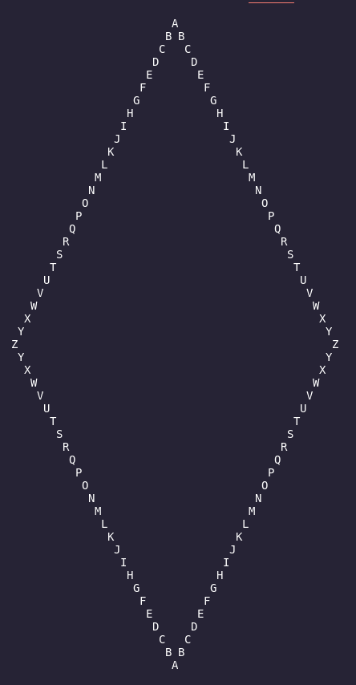

# diamond-c-sharp

# Projeto que cria um diamante de letras com as arestas de acordo com o input.


# Descrição
Esse projeto to tipo console tem como aplicação uma letra ser passada para o console e de acordo com a letra criar um diamante onde as arestas horizontais serão a letra desejada. Após a criação desse diamante, é dado a opcao de enviar esse diamante por email e também de salvar em um pdf.  


## Tecnologias usadas

* C#
* .Net
* VSCode
* Git/Github

# Clonar o projeto.
 Para clonar execute na pasta desejada

```
git clone git@github.com:FlipRAM/diamond-c-sharp.git

```

# Executar o projeto
Após clonar, para executar

```
cd diamond-c-sharp &&
dotnet restore &&
cd diamond &&
dotnet run
```

# Testes

Para executar os testes, basta estar na pasta origem e rodar:

```
dotnet test
```
